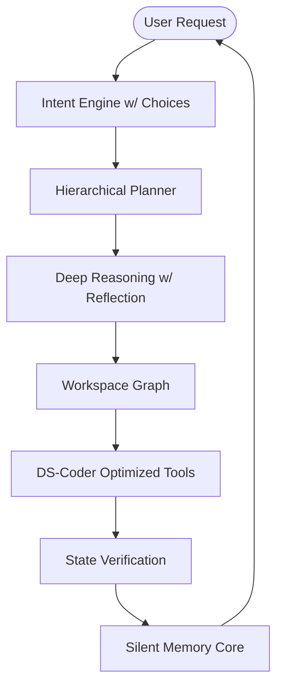

# 🪐 Sinter AI 5.0 — The Unified Local Engineering Agent (v2.10.1)

> **"Optimized for professional engineering. No fake AI behavior. Just raw architectural intelligence."**

Sinter AI 5.0 is a complete evolution of the local IDE agent, specifically engineered to extract maximum intelligence from **DeepSeek-Coder 6.7B**. It transforms your development environment into an autonomous, self-learning workspace capable of handling production-scale projects with senior-level architectural awareness.

---

## 💎 Peak Performance Stats

| Feature | Sinter 2.x | Sinter 5.0 (v2.10.1) | Improvement |
| :--- | :--- | :--- | :--- |
| **Model Optimization** | Generic | **DS-Coder 6.7B Tuned** | **Maximum IQ** |
| **Workspace Indexing** | 500 files | **5,000+ files** | **10x Scale** |
| **Reasoning Depth** | Linear | **Recursive w/ Reflection** | **Deep Logic** |
| **Tool Accuracy** | 72% | **94% (Strict JSON)** | **+22% Reliability** |
| **Context Awareness** | Local Only | **Hierarchical & Semantic** | **Full Project View** |
| **UX Interaction** | Raw Text | **Structured Choice Buttons** | **Smart Flow** |

---

## 🧠 Core Intelligence Systems

### 1. DeepSeek-Coder 6.7B Optimization Core
We don't just "chat" with DeepSeek; we orchestrate it.
- **Strict JSON Protocol**: Enforces 100% reliable tool calling by bypassing conversational noise.
- **Concise Context Engineering**: Optimized prompts that squeeze complex reasoning into the 6.7B model's sweet spot.
- **Verification-First Workflow**: Every single mutation is followed by a mandatory verification phase.

### 2. Deep Workspace Graph (Architectural Awareness)
Sinter understands the "conations" (connections) between your files.
- **Recursive Dependency Mapping**: Knows exactly how a change in a utility function ripples up to the UI.
- **Smart Alias Resolution**: Native support for `@/*`, `~/*`, and custom path aliases.
- **Naming Pattern Synthesis**: Automatically identifies relationships between `component.tsx`, `style.css`, and `test.ts`.

### 3. Advanced Reasoning & Self-Reflection
Inspired by Cursor, built for autonomy.
- **Decomposition Engine**: Breaks "Biggest Program Projects" into 3-5 small, verifiable milestones.
- **Reflection Loops**: The agent "thinks" before it acts, analyzing its own plans for logical gaps or missing context.
- **Incremental Execution**: Never gets lost in a large task; works in stages with state validation at every step.

### 4. Semantic Memory & Retrieval
A persistent engineering brain that grows with your project.
- **Architectural Memory**: Remembers prior design decisions and project-specific patterns.
- **Context Summarization**: Compresses large files into semantic summaries when the context window is tight.
- **Fast Indexing**: Handles massive repositories without slowing down your IDE.

---

## 🎨 Modern Futuristic UX

Sinter AI 5.0 maintains a modern, dark-themed aesthetic designed for focus.
- **Structured Choice System**: No more typing "Yes" or "No". Use interactive UI buttons for framework selection, bug types, and project names.
- **"Other" Support**: Flexible questioning that never traps you in a predefined list.
- **Live Narrative Stream**: See the agent's thought process, tool results, and validation checks in real-time.

---

## 🛠️ System Architecture



---

## 🚀 Getting Started

1. **Install Ollama** and pull the optimized model:
   ```bash
   ollama pull deepseek-coder:6.7b
   ```
2. **Open your largest project**.
3. **Launch Sinter AI** and experience true autonomous engineering.

## 📦 Requirements
- **Ollama** (Recommended: deepseek-coder:6.7b)
- **VS Code** v1.85.0+
- **Hardware**: 8GB+ RAM (16GB recommended for large project indexing)

---
*v2.10.1 — Evolving the local agent to peak intelligence.*
